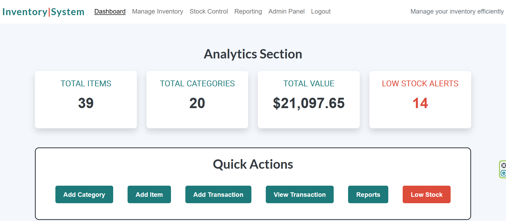

# Inventory Management System
## Site Preview

Visit the deployed site: [Inventory Management System](https://inventory-mgmt-app-1aceae60ebf8.herokuapp.com/)

## Overview

The Inventory Management System is a web-based application built using Django to manage and track inventory efficiently. This project provides an intuitive interface for users to handle stock management, generate reports, and monitor low-stock items through a responsive and accessible platform. It also displays information visually via interactive charts. 

## Index

## Project Description

### Main goals

1. Simplify inventory management tasks
2. Monitor inventory efficiently
3. Access comprehensive reports and charts
4. Provide responsive and exportable features

### User goals

1. Users want to add, edit, delete inventory items, and record transactions to maintain accurate stock data.
2. Users want to be able to track stock levels, item details, and low-stock alerts.
3. Users want to make informed decisions based on charts and detailed stock reports.
4. Users want to easily locate specific items and track inventory changes.

### Site owner goals

1. Ensure that the inventory data is accurate, up-to-date, and free of errors by providing robust tools for tracking stock levels and transactions.
2. Streamline the inventory management process by providing a centralized platform that minimizes manual work and improves productivity.
3. Offer insights and analytics to help users make informed business decisions.

### Features

#### Favicon

- A recognizable favicon is displayed in the browser tab, improving the site’s branding and making it easy for users to identify the website among open tabs. 

- Fully supported on all modern browsers and devices.

#### Navigation

- A responsive navigation bar with links to key pages: Dashboard, Manage Inventory, Stock Control, Reporting, Register, Login, and Logout.

- Links are highlighted based on the current active page for better user experience.

- Admin Panel is higgen for unlogged users.

- Collapsible menu for smaller screen sizes (hamburger menu).

#### Footer

- Includes social media links (Facebook, Twitter, Instagram) with icons.

- Provides users with accessible links to external profiles or pages.

#### Dashboard Page

- Analytics Section: Displays key metrics such as Total Items, Total Categories, Total Value, and Low Stock Alerts.

- Quick Actions: Includes buttons for frequently used actions (e.g., Add Category, Add Item, View Transactions).

- Charts Overview: Visualizations like bar charts, pie charts, and line charts for inventory data. 

- Each chart links to more detailed stock reports.

- Analytics cards adjust to fit smaller screen widths.

- Charts are fully responsive, resizing dynamically to fit any screen size.

#### Manage Inventory

- Search bar enable users to look for item title, category, description and SKU (stock keeping unit)

- Provides details for each item, such as SKU, quantity, price, and category.

- A searchable and paginated list of inventory items.

- Each item has a View Details button to view, edit, delete, or manage transactions.

- The list adapts to smaller screens, displaying essential details in a readable format.

- Pagination and search functionality are accessible on all devices.

#### Item Detail Page

- Displays detailed information about a specific inventory item, including description, quantity, price, and last updated date.

- Allows authenticated users to edit, delete, or record/view transactions.

- Includes a confirmation modal for delete actions.

- Layout adjusts for mobile screens, stacking buttons and text content vertically.

#### Stock Control (Low Stock Alerts) Page

- Displays a table of items that are low in stock, along with their quantity and low stock threshold.

- Provides View and Edit buttons for each item.

- The table is fully responsive, with horizontal scrolling enabled on smaller screens.

- Buttons adjust for easy touch navigation on mobile devices.

#### Reporting Page

- Stock Report: A detailed table showing inventory metrics such as total quantity, total value, average price, and low stock counts by category.

- All Inventory Items Table: Lists all items with sortable columns for easy analysis.

- Recorded Transactions Table: Displays transaction history for all items.

- Charts: Interactive and exportable visualizations for total quantity, category contribution, low stock trends, and total value by category.

- Tables support horizontal scrolling for smaller screens.

- Charts resize dynamically to fit screen dimensions.

#### Register, Login and Logout

- Register: Allows new users to sign up for an account.

- Login: Authenticated users can access restricted pages (e.g., Admin Panel).

- Logout: Ends the user session and redirects to the login page.

- Registration and login forms are fully responsive, adjusting for mobile screens without compromising usability.

#### Admin Panel Link

- Provides quick access to Django’s admin interface for site administrators.

- Accessible on all devices through the navigation bar.

#### Error pages (404 and 500)

- 404 Page: Informs users that the requested page was not found.

- 500 Page: Displays a server error message with a prompt to return to the home page.

- Both error pages are styled consistently and remain user-friendly across all devices.

#### Accessibility Features

- Buttons and links include ARIA labels for screen readers.

- Accessibility features are preserved across all screen sizes.

#### Data Export (Reporting Tables and Charts)

- Stock and transaction tables include export options (Copy, CSV, Excel, PDF, Print).

- Export buttons provide easy access to download or print data.

- Export buttons adjust their size and layout for smaller screens.

- Dynamic and interactive charts powered by Chart.js.

- Includes bar, line, pie, and horizontal bar charts for visualizing stock and transaction data.

- Charts can be exported as images for reports or presentations.

- Charts dynamically resize for all screen sizes while maintaining readability.

#### Forms for Adding and Editing Data

- Forms for adding/editing items and categories include validation and clear error messages.

- Intuitive design for recording transactions with item-specific fields.

- Forms adapt to smaller screens, with fields stacking vertically for better usability.

#### Future Implementations

1. Implement a system for assigning roles and permissions to users.
2. Use historical data and trends to predict future stock needs, helping to optimize inventory levels and avoid overstocking or shortages.
3. Maintain a log of all user actions (e.g., edits, deletions, and transactions) for accountability and troubleshooting.
4. Allow users to generate custom reports (e.g., specific date ranges or categories) and export them in various formats like CSV, Excel, or PDF.
5. Develop a mobile-friendly version of the site or a dedicated mobile app for on-the-go inventory management.

## Design

### Colour Scheme
The following colour palette has been used:
- **#F4F7FC**: background color for the body, providing a light and clean look.
- **#343a40**: text and general elements to create contrast and readability.
- **#1e7a7a**: brand color for the logo, buttons, headers.
- **#dd4b3a**: applied to alerts and danger buttons, as well as for important actions and warnings.
- **#495057**: footer and other darker sections.

Screenshots below show an example of the colour palette:

### Typography
The website uses the following font styles for its design:
- **Arial**: Used as the general font for the body text across the site.
- **Lato**: Applied to the branding elements and `h2` headings for a clean and modern appearance.

- **Roboto**: Used for `h3` headings, providing a professional and readable style.

The screenshot below is an example of the above styles combination:

## Testing
Detailed information about testing is available in the [Testing Documentation](TESTING.md).

## Deployment

### Heroku

The Application has been deployed from GitHub to Heroku by following these steps:

1. Create or log in to your account at heroku.com.
2. Create a new app, add a unique app name (e.g., financial-statements-analyser) and choose your region.
3. Click on create app.
4. Go to "Settings".
5. Under Config Vars, add the private API key information using key 'CRED' and the value from the .json file. Also, add a key 'PORT' and value '8000'.
6. Add required buildpacks. For this project, set Python on top and Node.js on the bottom.
7. Go to "Deploy" and select "GitHub" in "Deployment method".
8. Enter your repository name, click 'Search' and then 'Connect'.
9. Choose the branch to build your app from.
10. Optionally, enable "Automatic Deploys" to keep the app up to date.
11. Wait for the app to build. Once ready, you will see the “App was successfully deployed” message and a 'View' button to access your deployed link.

### Fork repository

To fork the repository:

1. Log in (or sign up) to Github.
2. Go to the repository for this project, [KatVolkova/inventory-management-system](https://github.com/KatVolkova/inventory-management-system).
3. Click the Fork button in the top right corner.

### Local Clones

To deploy the project on your own computer you can clone it:

- Navigate to the GitHub repository.
- Click the green '<> Code' button above the list of project files.
- From the 'Local' tab, select either HTTPS, SSH, or GitHub CLI as the method of cloning, and copy the associated link.
- Open the terminal or Bash prompt.
- Navigate to the directory where you want to store the cloned copy.
- At the prompt, type `git clone` and add the string copied earlier.
- Press 'Enter' to create the copy.

## Technologies Used

- HTML
- CSS
- JavaScript
- Python
- Django
- jQuery
- [Bootstrap](https://getbootstrap.com/)
- [Git](https://git-scm.com/) - For version control.
- [Github](https://github.com/) - To save and store the files for the website.
- [Google Fonts](https://fonts.google.com/) - To import the fonts used on the website.
- [Font Awesome](https://fontawesome.com/) - has been used for social networks links icons.
- [Google Chrome](https://www.google.co.uk/chrome/) has been used for website testing.
- [Google Developer Tools](https://developers.google.com/web/tools) - To troubleshoot and test features and solve issues with responsiveness and styling.
- [Charts.js](https://www.chartjs.org/) has been used for creating interactive charts.
- [DataTables](https://datatables.net/) has been used for creating interactive tables.
- [Microsoft Edge](https://www.microsoft.com/en-gb/edge/) has been used for website testing.
- [Firefox](https://www.mozilla.org/en-GB/firefox/new/) has been used for website testing.
- [Canva.com](https://canva.com/) To create and customise favicon.
- [Am I Responsive?](http://ami.responsivedesign.is/) To show the website image on a range of devices.
- [Pixlr](https://pixlr.com/) To re-size favicon
- [Grammarly](https://app.grammarly.com/ ) - has been used for spell-checking
- [Gitpod](https://gitpod.io/) has been used as an online IDE
- [Heroku](https://www.heroku.com//) has been used to host the website.

## Credits and References

- Templates for a favicon were taken and customised using [Canva](https://www.canva.com/)
- Fonts were taken from [Google Fonts](https://fonts.google.com/)
- Icons for the social networks links were taken from [Font Awesome](https://fontawesome.com/)
- Favicon was re-sized and converted into webp format using [Pixlr](https://pixlr.com/)
- [W3 schools](https://www.w3schools.com/) - For general documentation
- [ChatGPT](https://openai.com/index/chatgpt/) - For general debugging along with other tools and coding advice on using charts and DataTables
- [Chart.js](https://www.chartjs.org/docs/latest/) - For general documentation
- [DataTables](https://datatables.net/manual/) - For general documentation
- [How to use chart.js with Django](https://simpleisbetterthancomplex.com/tutorial/2020/01/19/how-to-use-chart-js-with-django.html) - advice on using Charts.js with Django framework
- [DataTables Django](https://docs.djangoproject.com/en/5.1/ref/databases/) - django documentation for using DataTables
- [Stackoverflow](https://stackoverflow.com/) - used for general code advice mostly on css responsiveness 
- [Views in Django](https://www.geeksforgeeks.org/views-in-django-python/) - provides clarification on using  views in Django

