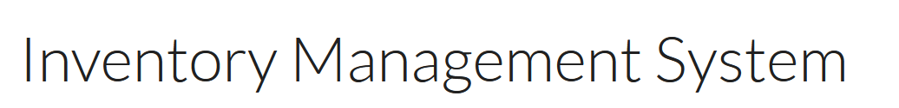

# Inventory Management System
## Site Preview

Visit the deployed site: [Inventory Management System](https://inventory-mgmt-app-1aceae60ebf8.herokuapp.com/)

## Overview

The Inventory Management System is a web-based application built using Django to manage and track inventory efficiently. This project provides an intuitive interface for users to handle stock management, generate reports, and monitor low-stock items through a responsive and accessible platform. It also displays information visually via interactive charts. 

## Index

## Project Description

### Main goals

1. Simplify inventory management tasks
2. Monitor inventory efficiently
3. Access comprehensive reports and charts
4. Provide responsive and exportable features

### User goals

1. Users want to add, edit, delete inventory items, and record transactions to maintain accurate stock data.
2. Users want to be able to track stock levels, item details, and low-stock alerts.
3. Users want to make informed decisions based on charts and detailed stock reports.
4. Users want to easily locate specific items and track inventory changes.

### Site owner goals

1. Ensure that the inventory data is accurate, up-to-date, and free of errors by providing robust tools for tracking stock levels and transactions.
2. Streamline the inventory management process by providing a centralized platform that minimizes manual work and improves productivity.
3. Offer insights and analytics to help users make informed business decisions.

### Features

#### Future Implementations

1. Implement a system for assigning roles and permissions to users.
2. Use historical data and trends to predict future stock needs, helping to optimize inventory levels and avoid overstocking or shortages.
3. Maintain a log of all user actions (e.g., edits, deletions, and transactions) for accountability and troubleshooting.
4. Allow users to generate custom reports (e.g., specific date ranges or categories) and export them in various formats like CSV, Excel, or PDF.
5. Develop a mobile-friendly version of the site or a dedicated mobile app for on-the-go inventory management.

## Design

### Wireframes

### Colour Scheme
The following colour palette has been used:
- **#F4F7FC**: background color for the body, providing a light and clean look.
- **#343a40**: text and general elements to create contrast and readability.
- **#1e7a7a**: brand color for the logo, buttons, headers.
- **#dd4b3a**: applied to alerts and danger buttons, as well as for important actions and warnings.
- **#495057**: footer and other darker sections.

Screenshots below show an example of the colour palette:

### Typography
The website uses the following font styles for its design:
- **Arial**: Used as the general font for the body text across the site.
- **Lato**: Applied to the branding elements and `h2` headings for a clean and modern appearance.

- **Roboto**: Used for `h3` headings, providing a professional and readable style.

The screenshot below is an example of the above styles combination:

## Testing
Detailed information about testing is available in the [Testing Documentation](TESTING.md).

## Deployment

### Heroku

The Application has been deployed from GitHub to Heroku by following these steps:

1. Create or log in to your account at heroku.com.
2. Create a new app, add a unique app name (e.g., financial-statements-analyser) and choose your region.
3. Click on create app.
4. Go to "Settings".
5. Under Config Vars, add the private API key information using key 'CRED' and the value from the .json file. Also, add a key 'PORT' and value '8000'.
6. Add required buildpacks. For this project, set Python on top and Node.js on the bottom.
7. Go to "Deploy" and select "GitHub" in "Deployment method".
8. Enter your repository name, click 'Search' and then 'Connect'.
9. Choose the branch to build your app from.
10. Optionally, enable "Automatic Deploys" to keep the app up to date.
11. Wait for the app to build. Once ready, you will see the “App was successfully deployed” message and a 'View' button to access your deployed link.

### Fork repository

To fork the repository:

1. Log in (or sign up) to Github.
2. Go to the repository for this project, [KatVolkova/inventory-management-system](https://github.com/KatVolkova/inventory-management-system).
3. Click the Fork button in the top right corner.

### Local Clones

To deploy the project on your own computer you can clone it:

- Navigate to the GitHub repository.
- Click the green '<> Code' button above the list of project files.
- From the 'Local' tab, select either HTTPS, SSH, or GitHub CLI as the method of cloning, and copy the associated link.
- Open the terminal or Bash prompt.
- Navigate to the directory where you want to store the cloned copy.
- At the prompt, type `git clone` and add the string copied earlier.
- Press 'Enter' to create the copy.

## Technologies Used

- HTML
- CSS
- JavaScript
- Python
- Django
- jQuery
- [Bootstrap](https://getbootstrap.com/)
- [Git](https://git-scm.com/) - For version control.
- [Github](https://github.com/) - To save and store the files for the website.
- [Google Fonts](https://fonts.google.com/) - To import the fonts used on the website.
- [Font Awesome](https://fontawesome.com/) - has been used for social networks links icons.
- [Google Chrome](https://www.google.co.uk/chrome/) has been used for website testing.
- [Google Developer Tools](https://developers.google.com/web/tools) - To troubleshoot and test features and solve issues with responsiveness and styling.
- [Microsoft Edge](https://www.microsoft.com/en-gb/edge/) has been used for website testing.
- [Firefox](https://www.mozilla.org/en-GB/firefox/new/) has been used for website testing.
- [Canva.com](https://canva.com/) To create and customise favicon.
- [Am I Responsive?](http://ami.responsivedesign.is/) To show the website image on a range of devices.
- [Pixlr](https://pixlr.com/) To re-size favicon
- [Grammarly](https://app.grammarly.com/ ) - has been used for spell-checking
- [Balsamiq](https://balsamiq.com/) - Used to create wireframes.
- [Gitpod](https://gitpod.io/) has been used as an online IDE
- [Heroku](https://www.heroku.com//) has been used to host the website.

## Credits and References

