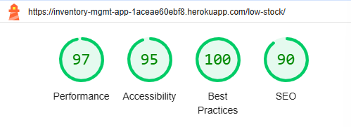

Return to the [Inventory Management System README.md](README.md).
# Testing

## Index

1. [User Story Validation](#user-story-validation)
2. [Features Testing](#features-testing)
    1. [Navigation Bar](#navigation-bar)
    2. [Tables](#tables)
    3. [Forms](#forms)
    4. [Dashboard](#dashboard)
        1. [Analytics Section](#analytics-section)
        2. [Quick Actions Section](#quick-actions-section)
        3. [Charts Overview](#charts-overview)
    5. [Manage Inventory](#manage-inventory)
        1. [Search Bar](#search-bar)
    6. [Reporting Page](#reporting-page)
        1. [Charts](#charts)
    7. [Footer](#footer)
3. [Code Validation](#code-validation)
    1. [HTML](#html)
        1. [Dashboard Page](#dashboard-page)
        2. [Manage Inventory Page](#manage-inventory-page)
        3. [Stock Control Page](#stock-control-page)
        4. [Reporting Page](#reporting-page-1)
    2. [CSS](#css)
    3. [JavaScript](#javascript)
        1. [charts.js](#chartsjs)
        2. [dashboard.js](#dashboardjs)
        3. [stock_report.js](#stock_reportjs)
        4. [tables.js](#tablesjs)
        5. [transactions.js](#transactionsjs)
    4. [Python](#python)
        1. [admin.py](#adminpy)
        2. [apps.py](#appspy)
        3. [error_views.py](#error_viewspy)
        4. [forms.py](#formspy)
        5. [models.py](#modelspy)
        6. [urls.py](#urlspy)
        7. [utils.py](#utilspy)
        8. [views.py](#viewspy)
    5. [Console](#console)
        1. [Dashboard Page](#dashboard-page-1)
        2. [Manage Inventory Page](#manage-inventory-page-1)
        3. [Stock Control Page](#stock-control-page-1)
        4. [Reporting Page](#reporting-page-2)
4. [Browser Compatibility](#browser-compatibility)
    1. [Google Chrome](#google-chrome)
    2. [Microsoft Edge](#microsoft-edge)
    3. [Firefox](#firefox)
5. [Accessibility](#accessibility)
6. [Performance](#performance)
7. [Responsiveness](#responsiveness)
    1. [Dashboard Page](#dashboard-page-2)
    2. [Manage Inventory Page](#manage-inventory-page-2)
    3. [Stock Control Page](#stock-control-page-2)
    4. [Reporting Page](#reporting-page-3)
    5. [404 Error](#404-error-2)
8. [Lighthouse](#lighthouse)
    1. [Dashboard Page - Desktop](#dashboard-page---desktop)
    2. [Dashboard Page - Mobile](#dashboard-page---mobile)
    3. [Manage Inventory Page - Desktop](#manage-inventory-page---desktop)
    4. [Manage Inventory Page - Mobile](#manage-inventory-page---mobile)
    5. [Stock Control Page - Desktop](#stock-control-page---desktop)
    6. [Stock Control Page - Mobile](#stock-control-page---mobile)
    7. [Reporting Page - Desktop](#reporting-page---desktop)
    8. [Reporting Page - Mobile](#reporting-page---mobile)
    9. [404 Error - Desktop](#404-error---desktop)
    10. [404 Error - Mobile](#404-error---mobile)
9. [Bugs](#bugs)
10. [Unfixed Bugs](#unfixed-bugs)

## User Story Validation

| **User Story**                  | **What to Expect**                                                                                                                                                                                                                                                                                                                                                                    | **Result** |
|---------------------------------|----------------------------------------------------------------------------------------------------------------------------------------------------------------------------------------------------------------------------------------------------------------------------------------------------------------------------------------------------------------------------------------|------------|
| **Add new items to inventory**  | A user can add a new item (name, quantity, SKU, category, description) via “Add Item” form in the quick activity section on the Dashboard page. If invalid details are entered, an error message is displayed.                                                                                                                                                                          |  Works as expected          |
| **View Inventory**              | A user can view a list of inventory items, their quantity, price, category, SKU, and last updated timestamp on the Manage Inventory Page. “View Details” button allows deletion and editing of the item’s information. Only a logged-in user can use the delete option.                                                                                                               |   Works as expected         |
| **Edit existing items**         | Only a logged-in user can edit an item, including its name, SKU, quantity, and category using the “View Details” button on the Manage Inventory page.                                                                                                                                                                                                                                                 |    Works as expected        |
| **Delete items from inventory** | Only a logged-in user can delete an item using the “View Details” button on the Manage Inventory page.                                                                                                                                                                                                                                                                                  | Works as expected            | 
| **Search inventory items**      | A user can search for an inventory item, category, SKU, or description via the Search bar on the Manage Inventory Page.                                                                                                                                                                                                                                                                |     Works as expected       |
| **Track Low Stock Alerts**      | A user can view the table listing low-stock items on the Stock Control page. The quantity limit is 10. A line chart shows low-stock trends. The full version of the chart is displayed on the Reporting page. Its mini version is displayed on the Dashboard page.                                                                                                                    |  Works as expected          |
| **Record Inventory transactions** | A user can record inventory transactions (stock in/stock out) via the “Add Transaction” button in the quick actions section on the Dashboard page or via the “View Details” button on the Manage Inventory page.                                                                                                                                                                     |    Works as expected        |
| **View Recorded Transactions**  | A user can view recorded transactions (stock in/stock out) via the “View Transaction” button in the quick actions section on the Dashboard page or via the “View Details” button on the Manage Inventory page. All recorded transactions are listed in the table on the Reporting page.                                                                                                     |     Works as expected       |
| **Register an account**         | Given a username and password, a user can register an account. When registration is successful, the user is redirected to the login page. If the provided details are invalid, an error message is displayed.                                                                                                                                                                            |    Works as expected        |
| **Log In / Log Out**            | When valid credentials are entered, the user is logged in. When the "Log Out" button is clicked, the user is logged out and redirected to the homepage. If invalid credentials are entered during login, an error message is displayed.                                                                                                                                                   |   Works as expected         |
| **Add Interactive Dashboard**   | A user can view the Dashboard page that includes: The Analytics Section (cards with key indicators); The Quick Actions Section where the user can add items, categories, add and view transactions, and go to the reporting page and stock control page. The Charts Overview Section where data is displayed visually.                                                                     |  Works as expected          |
| **Add Reporting page**          | A user can view the Reporting page that includes: a table of all inventory items; a table of all recorded transactions; a stock performance summary table; and corresponding charts.                                                                                                                                                                                                  |   Works as expected         |
| **Add Charts to the Reporting page** | A user can view the following charts on the Reporting page: A bar chart showing the total quantity of items per category; A line chart displaying the trends in low-stock items over time; A pie chart showing the proportion of total inventory value by category; A horizontal bar chart showing total value by category. All charts include tooltips displaying data values when hovering over chart elements. Users can export each chart as an image. |    Works as expected        |

## Features Testing

### Naviagation Bar

| Feature              | Action                                                                                     | Expected Result                                                                                       | Actual Result |
|-----------------------|-------------------------------------------------------------------------------------------|-------------------------------------------------------------------------------------------------------|---------------|
| Navigation Links      | Click each navigation link (Dashboard, Manage Inventory, Stock Control, Reporting, Admin Panel, Register, Login Logout). | Each link redirects to the correct page.                                                             |  Works as expected             |
| Slogan Visibility     | Resize the browser to small screen size (below 768px).                                     | "Manage your inventory efficiently" slogan disappears.                                               | Works as expected              |
| Toggle Menu           | Resize the browser to small screen size (below 768px) and click the hamburger menu icon.   | The navigation menu collapses into a toggle menu and expands/collapses when the toggle button is clicked. | Works as expected |
| Responsive Design     | Check the navigation bar on various screen sizes (large, medium, small).                  | The navigation bar adjusts seamlessly.                          | Works as expected |

### Tables

| Feature                      | Action                               | Expected Result                                     | Actual Result |
|------------------------------|--------------------------------------|---------------------------------------------------|---------------|
| All tables | Test search bar functionality       | Search bar filters rows correctly based on input  | Works as expected |
| All tables | Test export functionality           | File is downloaded with correct data              | Works as expected              |
| All tables | Check responsiveness on smaller screens | Table scrolls horizontally without breaking       | Works as expected              |
| All tables | Check pagination                    | Rows are paginated correctly, and navigation works|  Works as expected             |
| All tables     | Test table styling consistency       | Table headers and rows have consistent styles     |   Works as expected            |
| All tables     | Check column sorting                | Columns are sortable in ascending/descending order| Works as expected             |
| Low Stock Items table        | Test edit/view buttons functionality | Redirects to correct pages for each item          |  Works as expected             |
| Reporting - Stock Report     | Test summary row functionality               | Summary row shows the correct totals| Works as expected              |

### Forms

| **Feature**               | **Action**                                                                 | **Expected Result**                                                                                                     | **Actual Result** |
|---------------------------|---------------------------------------------------------------------------|-----------------------------------------------------------------------------------------------------------------------|-------------------|
| Add Item Form             | Fill out all fields and click "Save".                                     | The new item is added to the inventory.                              | Works as expected                  |
|                           | Leave a required field blank and click "Save".                           | A validation error message appears, and the form is not submitted.                                                    |  Works as expected                 |
|                           | Click "Cancel".                                                          | The form redirects the user to the previous page without saving changes.                                     |  Works as expected                 |
| Add Category Form         | Fill out all fields and click "Save".                                     | The new category is added.                                            | Works as expected                  |
|                           | Leave the "Name" field blank and click "Save".                           | A validation error message appears for the "Name" field, and the form is not submitted.                                | Works as expected                  |
|                           | Click "Cancel".                                                          | The user is redirected to the previous page without saving changes.                                                   | Works as expected                  |
| Record Transaction Form   | Select a transaction type, enter quantity, and click "Record Transaction". | The transaction is recorded, and the inventory is updated accordingly.                                                |Works as expected                   |
|                           | Leave the quantity blank and click "Record Transaction".                 | A validation error message appears, and the form is not submitted.                                                    | Works as expected                  |
|                           | Click "Cancel".                                                          | The user is redirected to the previous page without recording the transaction.                                         | Works as expected                  |
| Edit Item Form            | Modify an item's details and click "Save".                               | The item's details are updated, and the user is redirected to the updated inventory list.                              | Works as expected                  |
|                           | Click "Cancel".                                                          | The form redirects the user to the previous page without saving changes.                                     | Works as expected                  |
| View Transactions Page    | Select an item and view its transaction history.                         | A list of all transactions related to the selected item is displayed.                                                 | Works as expected                  |
| User Registration Form    | Fill out all fields and click "Register".                                | The user account is created.                                             | Works as expected                   |
|                           | Leave a required field blank and click "Register".                       | A validation error message appears for the blank fields, and the form is not submitted.                                | Works as expected                   |
| Login Form                | Enter valid credentials and click "Login".                               | The user is logged in and redirected to the dashboard.                                                                 | Works as expected                  |
|                           | Enter invalid credentials and click "Login".                            | An error message appears, and the user remains on the login page.                                                     | Works as expected                  |
|                           | Leave the fields blank and click "Login".                                | A validation error message appears, and the user is not logged in.                                                    | Works as expected                  |
| Responsiveness            | Resize the browser to small, medium, and large screen sizes.             | The form and buttons adjust across all screen sizes, maintaining usability.                  | Works as expected                  |
| Cancel Buttons            | Click "Cancel" on various forms (Add Item, Add Category, Edit Item, etc.)| The form resets or redirects the user to the previous page without saving any changes.                                 | Works as expected                  |
| Update Tables and Charts  | Submit a form that updates inventory or transactions.                    | The associated tables and charts update automatically to reflect the changes.                                          | Works as expected                  |

### Dashboard
#### Analytics section

| **Feature**                | **Action**                                                                                     | **Expected Result**                                                                                     | **Actual Result** |
|----------------------------|-----------------------------------------------------------------------------------------------|---------------------------------------------------------------------------------------------------------|-------------------|
| Total Items Card           | Verify the displayed number matches the total items in the inventory.                         | The card shows the correct total count of items (according to the Admin panel).                                                        | Works as expected                  |
| Total Categories Card      | Verify the displayed number matches the total categories in the inventory.                    | The card shows the correct total count of categories (according to the Admin panel).                                                      | Works as expected                  |
| Total Value Card           | Verify the displayed value matches the total monetary value of items in the inventory.        | The card shows the correct total value in currency format (according to Stock report table ).                         |Works as expected                   |
| Low Stock Alerts Card      | Verify the displayed number matches the count of items below the low-stock threshold.         | The card shows the correct count of low-stock items in red for visibility (according to Low stock items table).                              |Works as expected                   |
| Responsiveness             | Resize the browser to small, medium, and large screen sizes.                                  | The cards adjust seamlessly across screen sizes without overlapping or breaking the layout.             |Works as expected                   |
| Hover Effect               | Hover over each card.                                                                         | Each card displays a slight hover effect for interactivity.                     | Works as expected                   |
| Update on Data Change      | Add or remove items, categories, or transactions in the system.                               | The displayed data on the cards updates dynamically to reflect the changes.                             | Works as expected                  |

#### Quick Actions Section

| **Feature**                | **Action**                                                         | **Expected Result**                                                                                     | **Actual Result** |
|----------------------------|-------------------------------------------------------------------|---------------------------------------------------------------------------------------------------------|-------------------|
| Add Category Button        | Click the "Add Category" button.                                  | Redirects to the "Add New Category" form.                                                               | Works as expected                  |
| Add Item Button            | Click the "Add Item" button.                                      | Redirects to the "Add New Item" form.                                                                   | Works as expected                  |
| Add Transaction Button      | Click the "Add Transaction" button.                              | Redirects to the "Record a New Transaction" form.                                                       | Works as expected                  |
| View Transaction Button     | Click the "View Transaction" button.                             | Redirects to the "View All Transactions" page.                                                          | Works as expected                  |
| Reports Button             | Click the "Reports" button.                                      | Redirects to the "Reporting" page showing stock and inventory reports.                                    | Works as expected                  |
| Low Stock Button           | Click the "Low Stock" button.                                    | Redirects to the "Stock Control" page.                                                                | Works as expected                  |
| Responsiveness             | Resize the browser to small, medium, and large screen sizes.      | Buttons adjust their size, and layout remains seamless across all screen sizes.                         | Works as expected                  |
| Button Colors              | Hover over each button.                                           | Each button's background and border colour changes to indicate hover interactivity.              | Works as expected                   |

#### Charts Overview

| **Feature**                | **Action**                                                       | **Expected Result**                                                                                     | **Actual Result** |
|----------------------------|-----------------------------------------------------------------|---------------------------------------------------------------------------------------------------------|-------------------|
| All charts       | Hover over each bar in the chart.                               | Displays a tooltip with the category name and total quantity.                                           | Works as expected                  |
| All charts     | Resize the browser to different screen sizes (large, medium, small).                            | The chart adjusts its size.                                          | Works as expected                  |
| AAll charts              | Click on any of the four charts to  navigate to the reporting page               |  Link navigates to the full size charts with an export functionality on the Reporting page          |  Works as expected                 |

### Manage Inventory
#### Search Bar and Inventory list

| **Feature**                 | **Action**                                                                 | **Expected Result**                                                                                         | **Actual Result** |
|-----------------------------|---------------------------------------------------------------------------|-------------------------------------------------------------------------------------------------------------|-------------------|
| Search Bar                  | Enter a search term (e.g., item name, SKU, category).                      | The inventory items list updates to show only items matching the search term.                              | Works as expected                  |
|                             | Clear the search term using the "Clear" button.                           | The inventory items list resets to display all items.                                                      | Works as expected                  |
|                             | Test the search with various inputs (uppercase, lowercase, partial match).| The search is case-insensitive and matches partial terms appropriately.                                     | Works as expected                 |
|                             | Resize the browser to small screen sizes.                                 | The search bar adjusts its size, maintains readability, and does not overlap other elements.                | Works as expected                  |
| Inventory Items List        | Verify that each item displays its name, SKU, quantity, price, category, and last updated date. | All item details are visible and correctly formatted.                                                       | Works as expected                   |
|                             | Check that items with low stock are labeled with a "Low Stock" badge.     | Items below the low stock threshold display a clearly visible red "Low Stock" badge.                       | Works as expected                  |
|                             | Resize the browser to small screen sizes.                                 | The inventory items list stacks vertically and maintains readability without layout issues.                 | Works as expected                   |
| View Details Button         | Click the "View Details" button for an item.                              | Redirects to the item detail page for the selected item.                                                    | Works as expected                  |
|                             | Hover over the "View Details" button.                                     | The button changes appearance  to indicate interactivity.                              | Works as expected                   |
|                             | Resize the browser to small screen sizes.                                 | The "View Details" button disappears on smaller screens, and link is used to redirect to "Item details card".            | Works as expected                   |
| Mobile Responsiveness       | Test the entire page on a mobile device or small screen.                  | The search bar, inventory list, and buttons adjust seamlessly to fit smaller screens without overlapping.   | Works as expected                  |

### Reporting page
#### Charts
| **Feature**        | **Action**                                                                                                                                  | **Expected Result**                                                                                                                                                                | **Actual Result** |
|---------------------|--------------------------------------------------------------------------------------------------------------------------------------------|------------------------------------------------------------------------------------------------------------------------------------------------------------------------------------|-------------------|
| Total Quantity      | Hover over bars to view the data tooltips.                                                                                                 | Data tooltips display correct values when hovering over the respective bars.                                                                                                      | Works as expected                  |
| Total Value by Category | Hover over bars to view the data tooltips.                                                                                                 | Data tooltips display correct category values and corresponding amounts when hovering over the respective bars.                                                                   | Works as expected                  |
| Category Contribution | Hover over the pie chart sections to view the data tooltips.                                                                              | Data tooltips display the correct percentage contribution of each category.                                                                                                       | Works as expected                  |
| Low Stock Trends   | Hover over the line chart points to view the data tooltips.                                                                                 | Data tooltips display the correct trend data (e.g., item name and its low stock status).                                                                                          | Works as expected                  |
| Export Charts      | Click on the "Export as Image" button for each chart.                                                                                       | An image of the chart is downloaded.                                                                                                                                  | Works as expected                   |
| Responsiveness     | Resize the browser to various screen sizes (large, medium, small).                                                                          | All charts adjust seamlessly across different screen sizes, maintaining readability and proper alignment.                                                                         | Works as expected                  |
| Chart Data Accuracy | Verify the data displayed on each chart matches the database values.                                                                        | All chart data reflects accurate values from the database.                                                                                                                        | Works as expected                   |

### Footer
| Feature          | Action                                                                                 | Expected Result                                                                                      | Actual Result |
|-------------------|----------------------------------------------------------------------------------------|------------------------------------------------------------------------------------------------------|---------------|
| Footer Links      | Click each social media link (Facebook, X, Instagram).                          | Each link redirects to the correct respective external website (e.g., Facebook, X, Instagram). | Works as expected              |
| Responsive Design | Resize the browser to various screen sizes (large, medium, small).                    | The footer adjusts seamlessly across different screen sizes without overlapping or breaking layout.  | Works as expected              |
| Link Hover Effect | Hover over each social media link to observe the hover behavior.                      | Links display a hover effect (colour change) to indicate interactivity.            | Works as expected              |

## Code Validation

### HTML
Below are the results of HTML validation for each page, using the [W3C Markup Validation Service](https://validator.w3.org):

#### Dashboard Page

#### Manage Inventory Page

#### Stock Control Page

#### Reporting Page

### CSS 
Below are the results of CSS validation by direct input, using the [W3C CSS Validation Service](https://jigsaw.w3.org/css-validator).

### JavaScript
Below are the results of JavaScript validation for each file, using the [JSHint Validation Service](https://jshint.com/):
#### charts.js

#### dashboard.js

#### stock_report.js

#### tables.js

#### transactions.js

### Python
Below are the results of Python validation by direct input, using the [CI Python Linter](https://pep8ci.herokuapp.com/).
#### admin.py

#### apps.py

#### error_views.py

#### forms.py

#### models.py

#### urls.py

#### utils.py

#### views.py 

### Console
Below are the results of console output, using the Google Developer Tools, no errors have been found.
#### Dashboard Page

#### Manage Inventory Page

#### Stock Control Page

#### Reporting Page

## Browser Compatibitlity
he website has been tested in the following browsers:
### Google Chrome

### Microsoft Edge

### Firefox

## Responsiveness
All pages have been tested for responsiveness, using the [Responsive Web Design Checker](https://ui.dev/amiresponsive):

### Dashboard Page

### Manage Inventory Page

### Stock Control Page

### Reporting Page

### 404 Error

## Lighthouse
Each page has been reviewed using [Google Lighthouse](https://developer.chrome.com/docs/lighthouse/), for both mobile and desktop:
Please note that performance indicators for mobile phones is lower than for desktop. This is due to the fact that the site is optimised for 
desktop usage, as it is primarily intended for  tasks such as editing inventory, generating reports, and analyzing stock levels. 
The use of DataTables and charts may impact performance on mobile devices due to their computational and loading requirements.
### Dashboard Page -  Desktop

### Dashboard Page -  Mobile

### Manage Inventory Page - Desktop

### Manage Inventory Page - Mobile

### Stock Control Page - Desktop

### Stock Control Page - Mobile

### Reporting Page - Desktop

### Reporting Page - Mobile

## Bugs

## Unfixed Bugs

